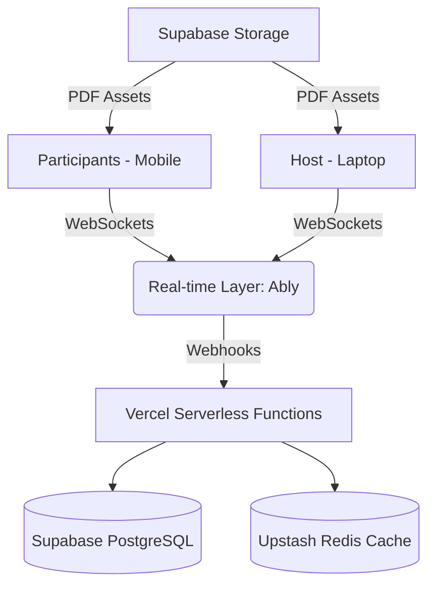

# SUMA: Seamless Universal Meeting Assistant


> **Bridge the gap between 1 and 1,000,000.**  
> SUMA is a a highly-scalable, real-time engagement platform designed for massive events. It humanizes large-scale digital interactions by unifying documentation, collaboration, and audience sentiment into a single, premium interface.

**🌐 Live Demo:** [https://suma-h.vercel.app/](https://suma-h.vercel.app/)

---

## ✨ Features

### 📄 Zero-Switch Document Sharing
*   **In-App Viewer**: Native support for PDF, PPTX, and Google Docs.
*   **Live Sync**: Participants' screens follow the host's slide transitions in real-time.
*   **Zero Latency**: Multi-layered CDN strategy ensures smooth transitions globally.

### 🎮 Gamified Quizzes & Polls
*   **Dynamic Visuals**: Real-time Bar, Pie, and Word Cloud visualizations.
*   **Audio/Voice Quizzes**: AI-powered voice recognition for verbal interactive rounds.
*   **Live Leaderboard**: "Fastest Finger First" logic with streak multipliers.

### 💬 Scalable Engagement
*   **Reaction Bursts**: Thousands of floating emojis populating the screen simultaneously without UI lag.
*   **Alias System**: Overcome participation anxiety with randomly assigned animal-based aliases.
*   **AI Moderation**: Real-time sentiment analysis and toxicity detection for safer communities.

### 📊 Real-time Analytics
*   **Engagement Score**: A live index calculated from participation frequency.
*   **Mood Meter**: Aggregate audience sentiment visualization.

---

## 🛠 Tech Stack

*   **Framework**: [Next.js 14+](https://nextjs.org/) (React)
*   **Real-time Layer**: [Ably](https://ably.com/) (Managed WebSockets)
*   **Database & Auth**: [Supabase](https://supabase.com/) (PostgreSQL)
*   **Infrastructure**: [Vercel](https://vercel.com/) (Global Edge Network)
*   **Styling**: [Tailwind CSS v4](https://tailwindcss.com/) with modern Glassmorphism & Neon accents.

---

## 🏗 Architecture

SUMA uses an **Event-Driven Architecture (EDA)** designed for extreme scalability. By leveraging Ably for real-time message broadcasting, we minimize server-side processing, allowing the platform to support up to **1,000,000 concurrent users** while remaining economically viable on Vercel's edge network.



---

## 🚀 Getting Started

### Prerequisites
*   Node.js 18+ 
*   npm / pnpm / yarn

### Installation

1.  **Clone the repository**:
    ```bash
    git clone https://github.com/hanvithSai/suma.git
    cd suma
    ```

2.  **Install dependencies**:
    ```bash
    npm install
    ```

3.  **Environment Setup**:
    Create a `.env.local` file with the following keys:
    ```env
    NEXT_PUBLIC_SUPABASE_URL=https://your-project.supabase.co
    NEXT_PUBLIC_SUPABASE_PUBLISHABLE_KEY=your-publishable-key
    ABLY_API_KEY=your-ably-api-key
    ```

4.  **Run Development Server**:
    ```bash
    npm run dev
    ```

Open [http://localhost:3000](http://localhost:3000) to view the application.

---

## 📅 Roadmap

- **Phase 1 (MVP)**: Room creation, PDF sharing, and basic MCQ polls. ✨ *Current*
- **Phase 2 (Experience)**: Reaction bursts, Alias system, and Leaderboards.
- **Phase 3 (Scale)**: Advanced AI moderation and 100k+ user stress testing.
- **Phase 4 (Enterprise)**: Full 1M user capability and SuperAdmin Analytics Dashboard.

---

## 🤝 Contributing

Contributions are what make the open source community such an amazing place to learn, inspire, and create. Any contributions you make are **greatly appreciated**.

1. Fork the Project
2. Create your Feature Branch (`git checkout -b feature/AmazingFeature`)
3. Commit your Changes (`git commit -m 'Add some AmazingFeature'`)
4. Push to the Branch (`git push origin feature/AmazingFeature`)
5. Open a Pull Request

---

## 📄 License

Distributed under the MIT License. See `LICENSE` for more information.

---

**Developed with ❤️ by [hanvithSai](https://github.com/hanvithSai)**
