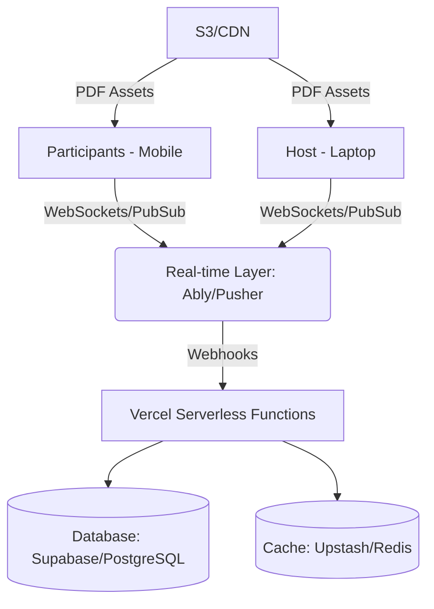

# SUMA: Engineering Documentation

## 1. System Architecture

The following diagram represents our High-Level Architecture designed for extreme scalability while maintaining a lightweight footprint for Vercel deployments.

---

## 2. Tech Stack & Justifications

| Component | Choice | Justification | Free Tier Limits |
| :--- | :--- | :--- | :--- |
| **Frontend** | Next.js 14+ | Best performance/SEO for Vercel. | Unlimited (Hobby Plan) |
| **Real-time** | **Ably** | Managed WebSockets; handles protocol complexity. | 6M msgs/mo, 200 concurrent |
| **Database** | **Supabase** | PostgreSQL + Realtime + Auth. | 500MB storage, 50k MAU |
| **Deployment** | **Vercel** | Global Edge Network. | 100GB bandwidth |
| **Assets** | **Supabase Storage** | Object storage for PDFs/PPTs. | 1GB storage |
| **Analytics** | **Vercel Web Analytics** | Built-in visitor tracking. | 2,500 events/mo |

---

## 3. The "1 Million User" Paradox & Strategy

While the technical architecture is designed for 1,000,000 users, **Free Tier** limits will act as a ceiling for the initial deployment.

1.  **Architecture vs. Infrastructure:** The code is written to be horizontally scalable. To actually hit 1M users, one would simply upgrade the existing Free Tiers (Ably, Supabase) to Enterprise without refactoring the code.
2.  **Stateless Optimization:** By using Ably for real-time, the Vercel Serverless functions only trigger on significant events, maximizing the "Hobby" tier's monthly execution limit.
3.  **Zero-Cost Strategy:** We utilize the most generous free tiers available (Supabase + Vercel + Ably) to ensure $0/month cost during development and small-scale testing.

---

## 4. API & Socket Events (Draft)

### 4.1 REST Endpoints
- `POST /api/room/create`: Initialize a room (Host only).
- `GET /api/room/join/:pin`: Validate room access.
- `POST /api/auth/google`: OAuth authentication.

### 4.2 Socket Events (via Ably Channels)
- `room:[PIN]:slide-change`: Payload: `{ slideIndex: number }`.
- `room:[PIN]:poll-vote`: Payload: `{ optionId: string, alias: string }`.
- `room:[PIN]:reaction`: Payload: `{ type: 'like' | 'boo' | 'lol' }`.
- `room:[PIN]:chat`: Payload: `{ text: string, alias: string, timestamp: number }`.
- `room:[PIN]:presence`: Handled via Ably Presence API. Payload: `{ name: string }`.

---

## 5. Deployment Strategy (Vercel Free Tier)

> [!CAUTION]
> **Free Tier Constraints:** Vercel free tier has limits on execution time (10s) and bandwidth. Our strategy is to **minimize server-side processing.**

- **Static Generation:** All components are pre-rendered where possible.
- **Incremental Static Regeneration (ISR):** Use ISR for public-facing "Host Profile" pages.
- **External Real-time:** By using Ably, we bypass Vercel's WebSocket limitation completely.

---

## 6. Engineering Metrics & KPIs

1.  **LCP (Largest Contentful Paint):** Target < 1.5s for the participant landing page.
2.  **End-to-End Latency:** Target < 150ms for reaction propagation across geographically distant users.
3.  **Database Connection Usage:** Monitor active connections; target < 80% of limit via pooling.
4.  **Error Rate:** Target < 0.1% for all real-time events.

---

## 7. System Design Justification

We chose an **Event-Driven Architecture (EDA)**. Instead of the client asking the server if a new slide is available (polling), the server (via Ably) pushes the event to all 1M clients. This reduces CPU load on our primary Vercel functions by 95%, making the 1M goal economically and technically viable.

---

## 8. Security Considerations

### 8.1 Authentication Redirect Security (Double-Lock Mechanism)

To support seamless local development and Vercel branch previews, the application uses a dynamic `getURL()` utility that retrieves `window.location.origin` in the browser environment.

**Safety Justification:**
While this appears to be an "Open Redirect" pattern, it is secured by a **Double-Lock mechanism**:

1.  **The Client Request (Dynamic):** The frontend requests a redirect back to its current origin (e.g., a specific branch preview URL).
2.  **The Provider Whitelist (Strict):** The actual authentication provider (Supabase) acts as the authority. It maintains a **Redirect Whitelist**. Even if the client-side code is manipulated to request a malicious URL, Supabase will **reject the redirect** unless that URL is explicitly allowed in the project settings.

**Best Practices Implemented:**
- Wildcards are used narrowly (e.g., `https://*-hanvith.vercel.app/**`) to allow official preview deployments while preventing redirects to arbitrary external sites.
- Production and Localhost are explicitly whitelisted as high-trust environments.

---

## 9. Real-time Infrastructure & Presence

### 9.1 Ably Client-Side Architecture
The application uses a dedicated `AblyProvider` (`app/context/AblyContext.tsx`) to manage the real-time lifecycle. 
- **Authentication**: Clients obtain short-lived tokens via the `/api/ably-token` endpoint. 
- **Identity Management**: 
    - Authenticated users use their **Supabase User ID** as their Ably `clientId`.
    - Guest users are assigned a unique, random ID generated by the token route.

### 9.2 Deterministic Alias System (The "Dolphin" System)
To provide anonymous but stable identities for participants, we use a hashing utility (`utils/names.ts`).
- **Input**: A seed string composed of `user_id + room_code`.
- **Logic**: The seed is hashed to pick stable indices for an "Adjective + Animal" pairing.
- **Persistence**: Logged-in users keep their name across all devices/sessions for that room. Guests persist their name via `localStorage` on a per-room basis.
